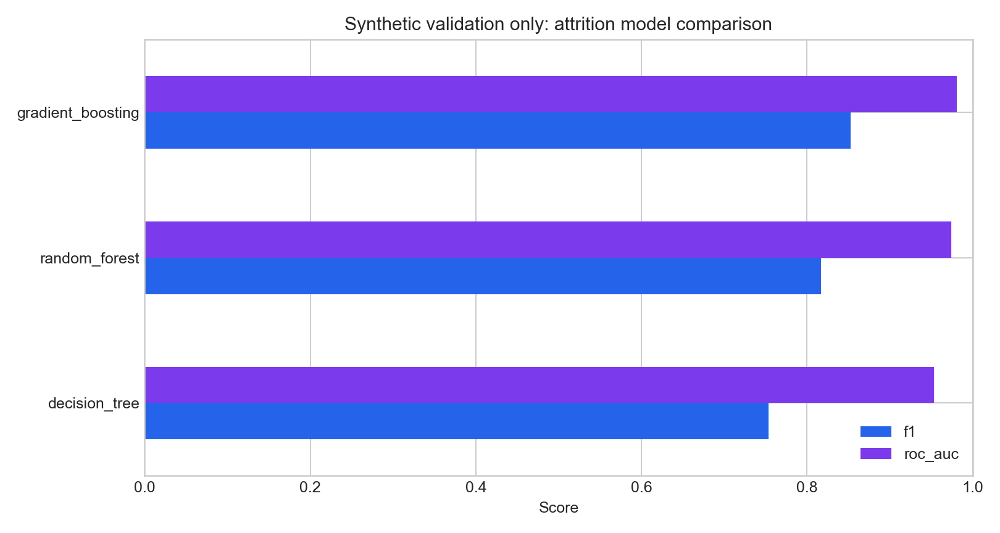
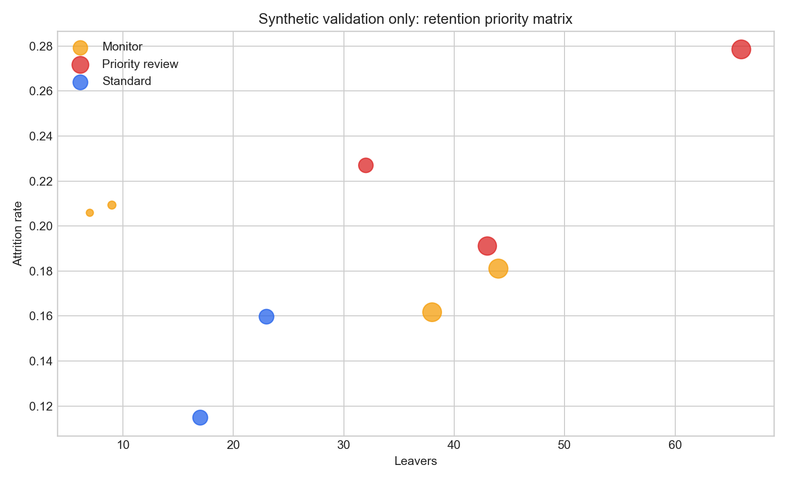

# Employee Attrition Decision Analytics

This project examines where employee attrition is concentrated, compares three classification models on the same test population and separates high attrition rates from the number of employees affected.

The submitted MSc project used KNIME and Tableau on **1,450 employees**, including **279 leavers**. It found the strongest descriptive concentration around overtime, age, role and department. Because the university source file is not available for publication, this repository checks the same decision logic with a clearly labelled synthetic dataset.

## Business question

An attrition model is useful only if it leads to a responsible intervention. This project therefore moves from prediction to prioritisation: where is attrition unusually concentrated, how many employees are affected, which patterns remain visible across different models, and what should HR investigate at team level?

The unit of action is a workforce segment rather than an individual employee. Overtime, role, department and age bands are used to identify operating conditions worth reviewing; they are not used to label a person as a likely leaver or to support an adverse employment decision.

## What I built

The original assignment combined KNIME data preparation and classification with a Tableau storyboard. I prepared the data, compared decision tree, random forest and gradient-boosted models, interpreted the main predictors and connected the results to retention recommendations. The public version rebuilds the decision logic in Python, applies consistent class treatment across models, exports a segment-level priority table and adds automated checks around row grain, labels and saved results.

## Historical project evidence

The submitted analysis reported:

| Model | Accuracy | ROC-AUC |
|---|---:|---:|
| Decision tree | 81.59% | 0.725 |
| Random forest | 86.20% | 0.871 |
| Gradient boosted trees | **87.24%** | **0.895** |

These figures describe the archived KNIME run. The Python pipeline reports its synthetic check separately and applies the same class-weighting logic across models for a fairer comparison.



## Decision framework

A high attrition rate can affect very few employees; a large department can create many leavers at a moderate rate. The decision output therefore uses both:

- **risk intensity:** attrition rate within a segment;
- **business exposure:** number of leavers in that segment.

Segments in the high-rate, high-volume quadrant become the first candidates for workload review, management investigation and retention testing.

That distinction changes the management response. A small segment with a high rate may need a focused qualitative investigation; a large segment with a moderate rate may create the greater recruitment, training and continuity cost. The matrix keeps both questions visible.



## Evaluation design

- Stratified 80/20 train/test split.
- Preprocessing fitted inside each model pipeline.
- Identical test population for decision tree, random forest and gradient boosting.
- Class weights applied consistently instead of balancing only one model.
- Precision, recall, F1 and ROC-AUC reported alongside accuracy.
- Synthetic and historical results kept in separate tables.

## Repository guide

| Path | Purpose |
|---|---|
| `src/attrition.py` | Preparation, model pipelines, evaluation and priority matrix |
| `scripts/generate_demo_data.py` | Reproducible 1,450-row synthetic HR dataset |
| `scripts/run_analysis.py` | Model run and output generation |
| `outputs/` | Labelled metrics and decision tables |
| `figures/` | Model and intervention visuals |
| `tests/` | Data-grain, label and output checks |

## Run it

```bash
python -m venv .venv
source .venv/bin/activate
python -m pip install -r requirements.txt
python scripts/generate_demo_data.py
python scripts/run_analysis.py
python -m unittest discover -s tests -v
```

## Management boundary

This analysis identifies associations and supports prioritisation. It does not establish that overtime causes attrition, and it must not be used for adverse employment decisions about individuals. Any live deployment would require fairness review, data-protection controls, employee consultation and intervention testing.

## Author

**Muhammad Ahmed Shoaib**<br>
HR analytics, classification and decision communication.
